# kottans-frontend
### About me 
Hello, my name is Dimond. I like to explore smth new and this course great challange for me. Actually I have some experience in the past life, but when I have watched course content, understood that can help to grow up in hard skills.

**General**
- [x] [Git Basics](#git-basics)
- [x] [Linux CLI and Networking](#linux-cli-and-networking)
- [x] [Git Collaboration](#git-collaboration)

**Front-End Basics**
- [ ] [Intro to HTML and CSS](#intro-to-html-and-css)
- [ ] [Responsive Web Design](#responsive-web-design)
- [ ] [HTML CSS Popup](#html-css-popup)
- [ ] [JS Basics](#js-basics)
- [ ] [DOM](#dom)

**Advanced Topics**
- [ ] [A Tiny JS World](#a-tiny-js-world) 
- [ ] [Object Oriented JS](#object-oriented-js)
- [ ] [Object Oriented JS](#object-oriented-js)
- [ ] [Object Oriented JS](#mamory-pair-game)
- [ ] [Website Performance Optimization](#website-perfomanse)
- [ ] [Friends App](#friends-app)

## Git Basics

1.1 Course: Version Control with Git (week 1, week 2) (screenshots)

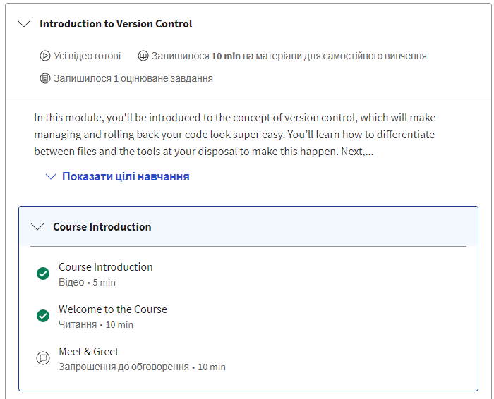
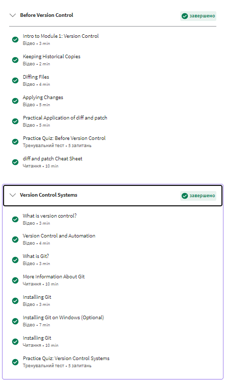
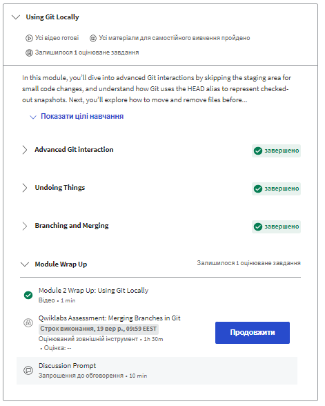
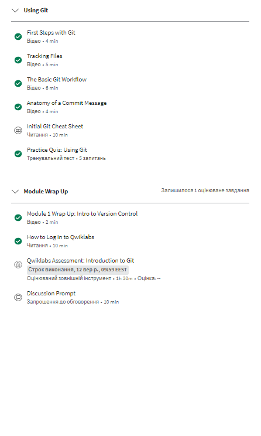

I already have basic knowledge about git and used common patterns in the small study projects. But I would share smth new for me commands <b> git diff </b> : show all changes in the project and has similar feature with additional tags for example <b> git diff --staged </b>: show staged changes; <b> git rm [name file] </b> : delete file from project; <b> git mv [old_file.js] [new_file.js] </b> : rename file; <b> git add -a -m "comment commit" </b> : fast way to commit changes; <b> git log --graph --oneline </b> : shows git history project

1.2 Course: learngitbranching.js.org (screenshots)

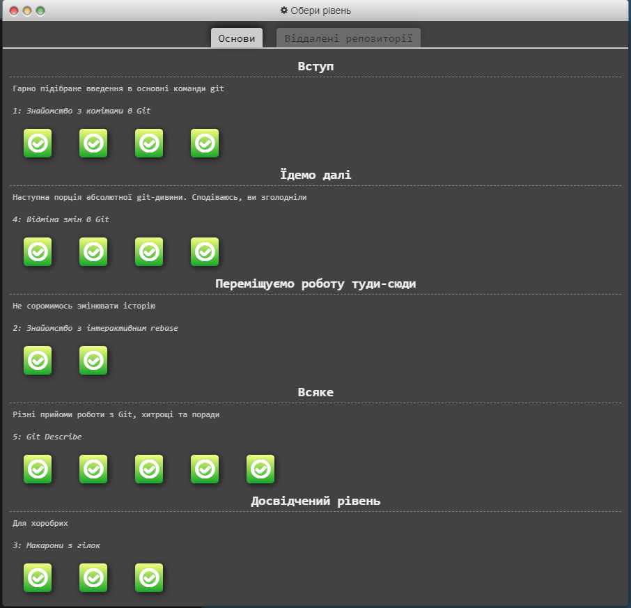
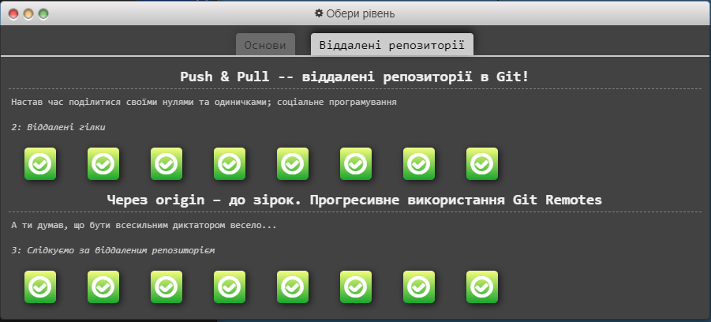

Best visual tutorial about git that I have ever seen. Gradual load of educational material greatly helps to learn the material. I especially have liked the discussion about what best use rebase or merge.

## Linux CLI, and HTTP

2.1 Course: Linux Survival (screenshots)

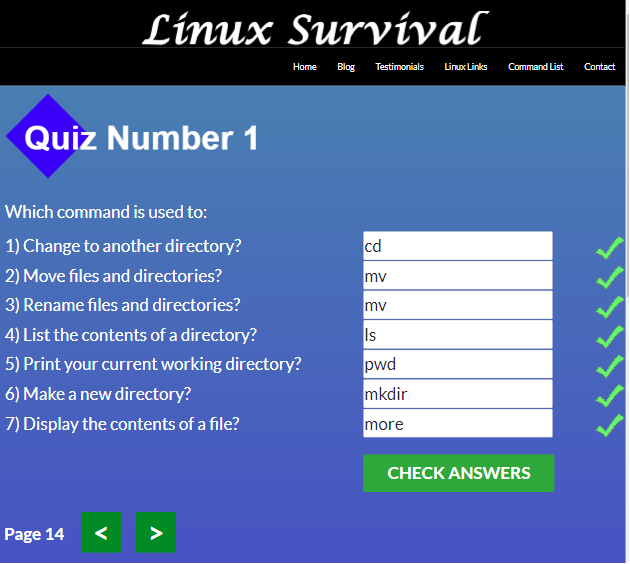
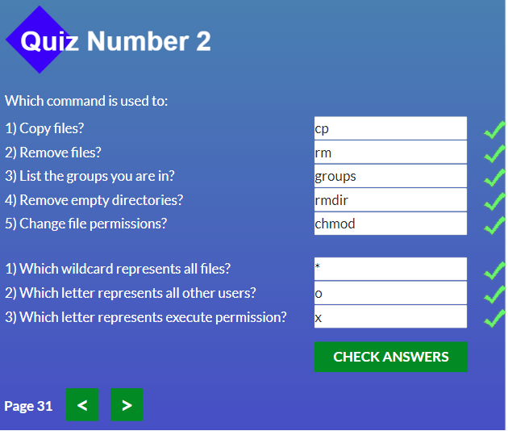
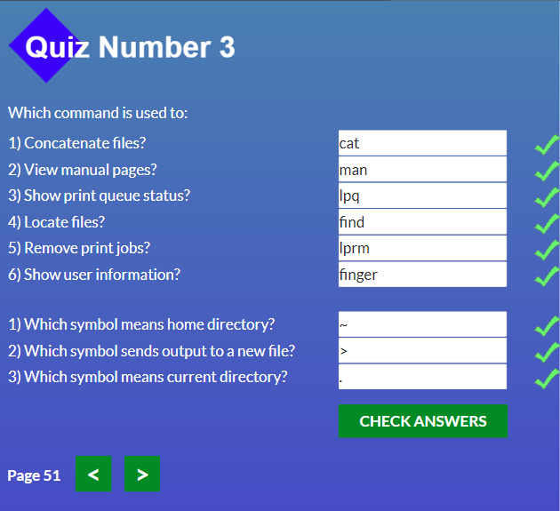
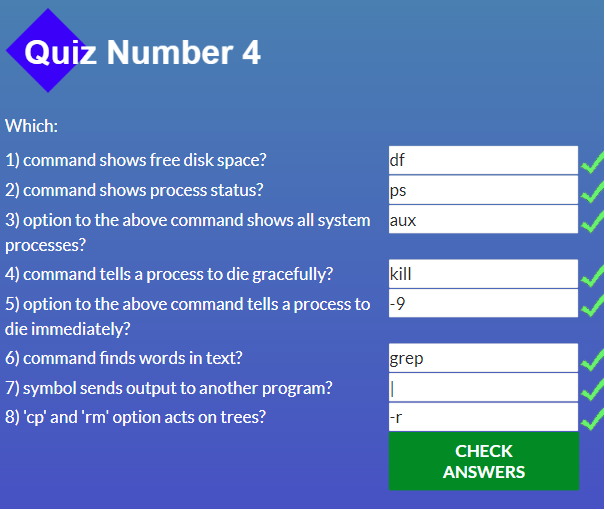

I have passed Linux CLI course and that shows how linux works and how I can doing project with them in future. First and second part course gives base model interconnection between me and OS, I have already familiar with some commands, and it isn't bad to repeat them. 
New staff for me were command
1 module:
<ul>
  <li>
    <b>more</b>, show detail about file
  </li>
  <li>
    special argument <b> ".." </b>
  </li>
</ul>

2 module:
<ul>
  <li>
    <b>cp</b>, copy file and <b>rm</b> remove file
  </li>
  <li>
    <b>chmod</b>, give permission user, a bit suprised me I have never met simple way to give permission with different scenario (read, write, execute) 
</ul>

3 module:
<ul>
  <li>
    All command were new for me. I like command cat and man also command find will be useful
  </li>
</ul>
4 module:
<ul>
  <li>
    Thought material about where I can provide it and will be usuful for me?. Anyway <b>ps aux</b> get a detailed list of all processes probably should hold this into my memory)
  </li>
  <li>
    <b>kill ___</b> light version close active processes
  </li>
  <li>
    <b>kill -9</b> heavy version close active processes
  </li>
</ul>

I have read and partially understood how the http protocol works. I think that such details need to be understood for further work in the web project. I have liked the part about how SSL works and her type RSA encryption, showing the main difference between http and https. It is also quite important to explain the work between the client and the server, and how they exchange datas. I also paid attention to the hashing process, its types are private and public, I haven't been knowing that hashing can be controlled since I read this article. Cool

## Git Collaboration

Git Collaboration week 3

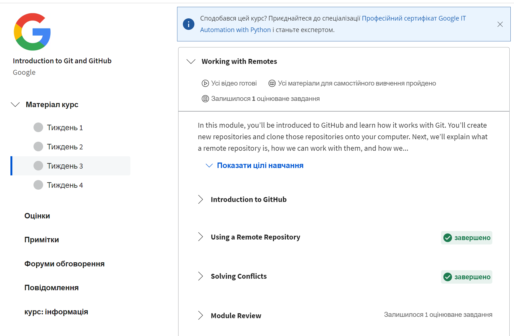

Actually I've expirensed with GitHub and known how to work with him (basic version I think =) ). In this module I've found for me solve conflicts with console before that I've solved with git extension (ui). And previous part in the portal learngitbranching I passed all task in one time and some lesson here (coursera) was more easier.

Git Collaboration week 4

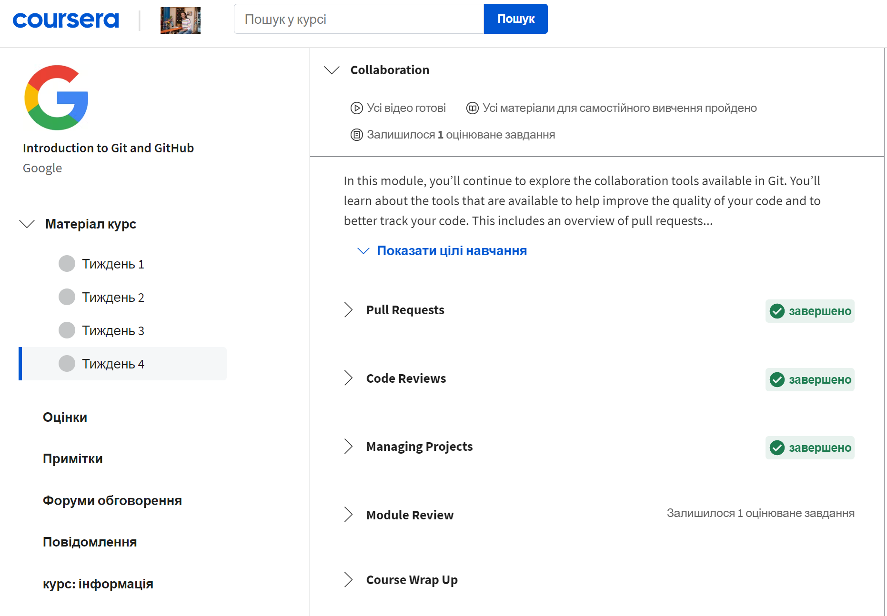

So good material. Really useful guides about pull request on GitHub. I've uderstood what a code review and workflow relative with them. I saw how managing projects and accepting or rejecting changes in project.

## Intro to HTML and CSS

Intro to HTML and CSS

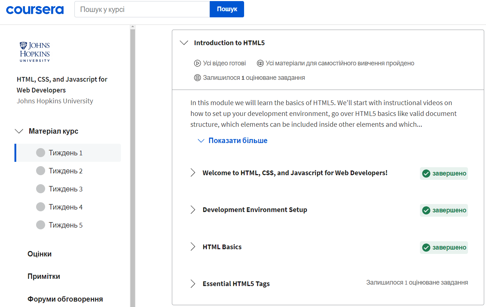
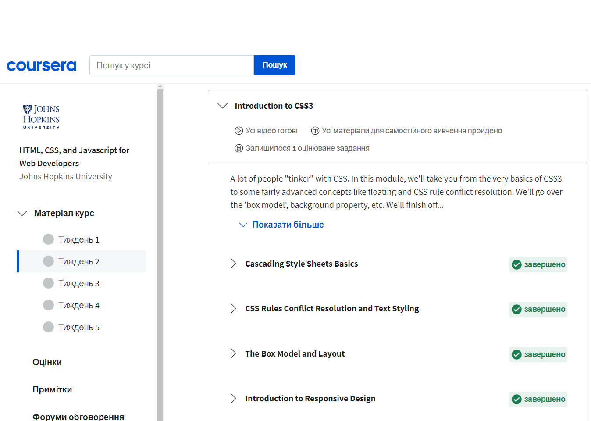

A bit of a boring course, but maybe that's because I was familiar with almost all of the material. I've learned something new HTML Character Entity References, I don't think so now it's actual but ok. I was amazed at how Stackoverflow's main page looks like in 2015 =) and second version Bootstrap in those times it called Twitter Bootstrap. 